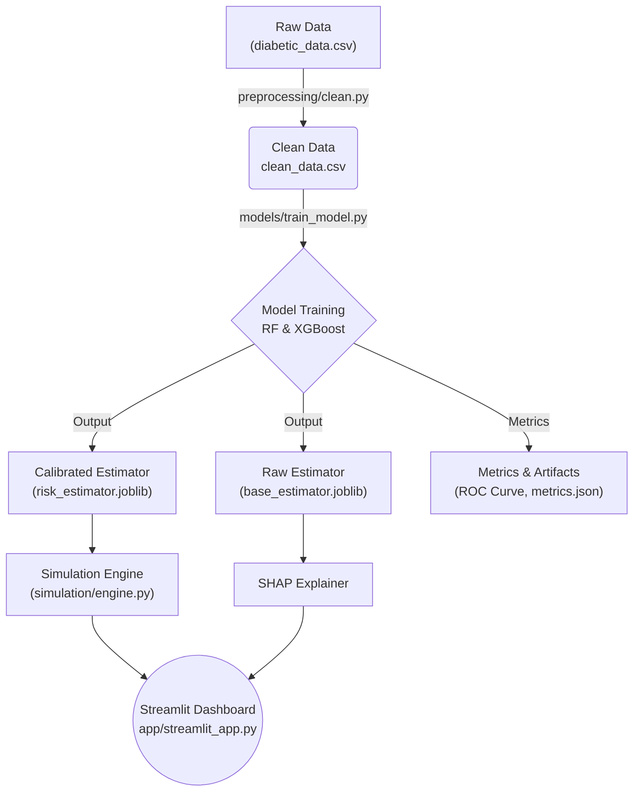

# 🏥 Patient Digital Twin (MVP)


> **⚠️ Medical Disclaimer:** This portal is designed solely for understanding Digital Twins as a concept and for experimental purposes. It does not replace professional medical advice, diagnosis, or treatment. The predictions and simulations provided are not guaranteed to be factual or represent true clinical outcomes. Always consult a qualified healthcare professional or doctor for medical decisions.

## 📌 Executive Summary
*This project has been made in subject with the Northeast Big Data Innovation Hub.*

The **Patient Digital Twin** is a Minimum Viable Product (MVP) designed to forecast 30-day readmission risk for diabetic patients and simulate their future health trajectories under various clinical interventions. 

Built using the **[UCI Diabetes 130-US hospitals dataset](https://archive.ics.uci.edu/dataset/296/diabetes+130-us+hospitals+for+years+1999-2008)** (101,766 clinical encounters, 1999–2008), this tool empowers clinical decision-making by combining **calibrated machine learning risk models** (Random Forest/XGBoost), **Monte Carlo simulations**, and **SHAP-based explainability** into a seamless, interactive dashboard.

---

## ✨ Key Features
- **Predictive Risk Modeling:** Highly calibrated models handling imbalanced clinical data to estimate baseline 30-day readmission risk.
- **Monte Carlo Simulation Engine:** Projects patient outcomes forward in time under 4 unique clinical scenarios (e.g., Medication added, Lifestyle improvement), complete with confidence intervals.
- **Explainable AI (XAI):** Integrated SHAP (SHapley Additive exPlanations) highlights the exact patient characteristics driving their specific risk score.
- **Interactive Clinical Dashboard:** A Streamlit-powered UI allowing users to adjust patient profiles and instantly visualize simulated trajectories.

---

## 🚀 Quickstart & Setup

It is highly recommended to use a virtual environment (like `conda` or `venv`) to ensure dependencies do not conflict with system packages.

### 1. Clone the Repository
```bash
git clone <your-repo-url>
cd Patient_Digital_Twin
```

### 2. Create a Virtual Environment (Optional but Recommended)
**Using Conda:**
```bash
conda create -n digital_twin python=3.9 -y
conda activate digital_twin
```
*Or using venv:*
```bash
python3 -m venv venv
source venv/bin/activate  # On Windows use `venv\Scripts\activate`
```

### 3. Install Dependencies
```bash
pip install -r requirements.txt
```

### 4. Run the Pipeline
The project is built sequentially. Run the following commands in order from the project root:

```bash
# Step A: Clean and preprocess the raw data
python preprocessing/clean.py

# Step B: Train, calibrate, and save the ML models
python models/train_model.py

# Step C: Launch the Interactive Dashboard
streamlit run app/streamlit_app.py
```
*The dashboard will automatically open in your default web browser at `http://localhost:8501`.*

---

## 🏗️ System Architecture



### Module Breakdown
- **`preprocessing/clean.py`**: Performs schema validation, missing value imputation, and feature encoding (One-Hot, Binary) to prepare clinical data for ML consumption.
- **`models/train_model.py`**: Handles dataset splitting, tackles class imbalance (`class_weight='balanced'`), trains candidate models, calibrates probabilities (Isotonic Regression), and exports serialized `.joblib` models.
- **`simulation/engine.py`**: Wraps the predictive model with a deterministic Monte Carlo rule-based transition engine. Applies clinical interventions over multiple steps, returning mean risk trajectories ± 1 standard deviation.
- **`app/streamlit_app.py`**: The frontend UI. Combines Plotly visualisations, KPI scorecards, and SHAP explainability into a responsive user experience.

---

## 📊 Model Performance (Test Set)

The target class (readmission within 30 days) represents ~11% of the dataset.

| Model | ROC-AUC | F1 Score | Precision | Recall |
|---|---|---|---|---|
| Random Forest | 0.645 | 0.263 | 0.194 | 0.406 |
| XGBoost | 0.633 | 0.251 | 0.171 | 0.468 |
| **Calibrated RF** *(Deployed)* | **0.643** | **0.261** | **0.198** | **0.382** |

*Note: Models are evaluated at the threshold that maximizes the F1 score, rather than a default 0.5 threshold, to better handle the imbalanced nature of clinical readmissions.*

---

## 🔬 Assumptions & Future Work
- **Risk Proxy:** Readmission is currently used as a proxy for overall disease severity.
- **Synthetic Transitions:** Time-series transitions (e.g., HbA1c changes) are currently generated using synthetic, rule-based deltas rather than being learned from longitudinal observational sequences.
- **Future Enhancements:** 
  - Integrate a **Causal Inference Layer** (e.g., Doubly Robust Estimation) to ground intervention effects in statistical causality rather than rules.
  - Expand feature engineering to include detailed medication dosing and discharge risk factors.
