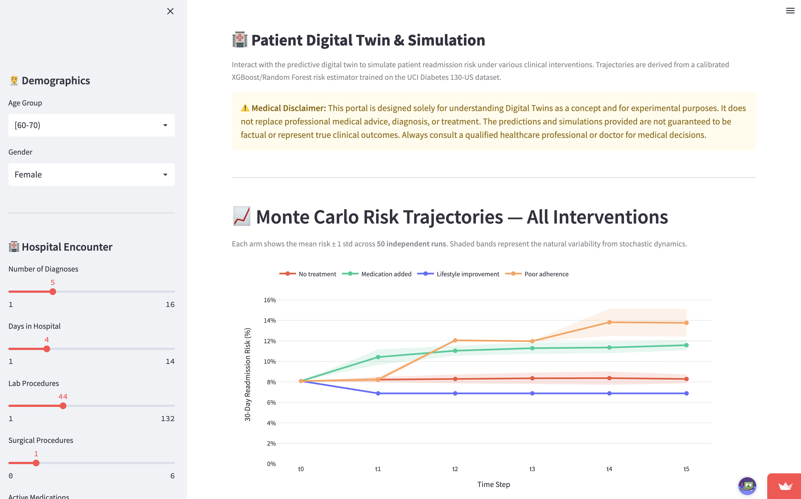
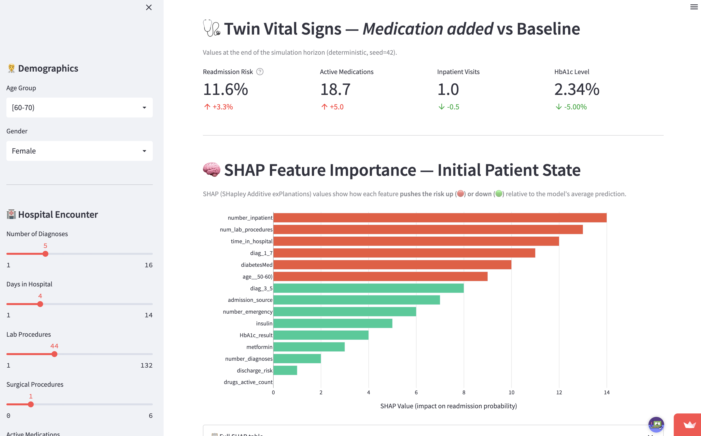

# 🩺 Patient Digital Twin

**A simulation-first system for exploring 30-day hospital readmission risk in diabetic patients — pairing a calibrated risk model with Monte Carlo trajectory simulation and SHAP explainability in an interactive dashboard.**

[](https://digital-twin-with-ml-based-prediction.streamlit.app/)


> Built with the UCI Diabetes 130-US Hospitals dataset (101,766 encounters) · In collaboration with the Northeast Big Data Innovation Hub

## What this is

A *digital twin* is a computational stand-in for a real system that lets you ask "what if?" without touching the real thing. This project builds one for a diabetic patient: given a clinical profile, it estimates readmission risk, **simulates how that risk evolves under different care decisions**, and explains *why*. The value isn't a single prediction — it's an interactive model you can interrogate.

## A note on the model, up front

30-day readmission on this dataset is a genuinely hard prediction problem — published work tops out around **ROC-AUC 0.65–0.70**, and this model lands in that range (**≈0.64**). That's expected, and it's the point: the contribution here is the **simulation and explainability layer** built on top of a realistic, honestly-calibrated risk model, not squeezing out a marginally higher AUC on a known-hard target. A prediction you can trust and explain beats a higher score you can't.

## Features

- **📊 Calibrated risk model** — Random Forest / XGBoost with probability calibration and class-imbalance handling on an ~11%-positive target.
- **🎲 Monte Carlo simulation engine** — projects a patient's risk trajectory under four scenarios: *no treatment, medication added, lifestyle improvement, poor adherence* — with confidence bands over 50 runs.
- **🔍 SHAP explainability** — surfaces the factors driving an individual's risk (top signal: prior inpatient visits).
- **🖥️ Interactive dashboard** — adjust a patient profile and watch risk, trajectory, and explanations update live.

## 🔗 Live demo

**[Launch the app →](https://digital-twin-with-ml-based-prediction.streamlit.app/)**

## Screenshots

**Monte Carlo risk trajectories across four interventions:**



**SHAP explanation + twin vital signs for a single patient:**



## How it works

```text
Raw data (UCI, 101K encounters)
        |  preprocessing/clean.py   -- schema validation, imputation, encoding
        v
Clean feature table
        |  models/train_model.py    -- training, class weighting, calibration
        v
Calibrated risk estimator (.joblib)
        |
        +----------------+-------------------+
        v                v                   v
   Risk score     Monte Carlo engine    SHAP explainer
                  (simulation/engine.py)
        |                v                   |
        +------> app/streamlit_app.py (dashboard) <------+
```

## Model performance (test set)

| Model | ROC-AUC | F1 | Precision | Recall |
|-------|---------|----|-----------|--------|
| Random Forest | 0.645 | 0.263 | 0.194 | 0.406 |
| XGBoost | 0.633 | 0.251 | 0.171 | 0.468 |
| **Calibrated RF (deployed)** | **0.643** | **0.261** | **0.198** | **0.382** |

Target class (30-day readmission) ≈ 11% of the data. See the note above on why this range is expected.

## Run it locally

```bash
git clone https://github.com/ishmeen-11/Patient-Digital-Twin.git
cd Patient-Digital-Twin

conda create -n digital_twin python=3.9 -y
conda activate digital_twin
pip install -r requirements.txt

python preprocessing/clean.py       # data cleaning
python models/train_model.py        # train + calibrate (regenerates model .joblib files)
streamlit run app/streamlit_app.py  # launch dashboard at localhost:8501
```

## Repository structure

```text
Patient-Digital-Twin/
├── app/            # Streamlit dashboard
├── preprocessing/  # data cleaning pipeline
├── models/         # training + serialized model artifacts
├── simulation/     # Monte Carlo simulation engine
├── data/           # dataset
├── results/        # metrics + plots
├── requirements.txt
└── README.md
```

## Limitations & future work

- **Readmission as a proxy** for disease severity — a modeling convenience, not ground truth.
- **Simulation transitions are rule-based**, not learned from longitudinal data (the MVP boundary).
- **Correlation, not causation** — e.g. "medication added" correlates with higher risk because sicker patients receive more medication. **Next:** a causal-inference layer (Doubly Robust Estimation) so "what if we change this treatment?" is answered causally.

## ⚠️ Medical disclaimer

This project is for research and educational purposes only. It does **not** replace professional medical advice, and its predictions are not guaranteed to be factual.

## 📝 Read more

Full write-up on Medium: **[Can We Simulate a Patient's Next 30 Days?](https://medium.com/@ishmeengarewal/can-we-simulate-a-patients-next-30-days-128134ec395f)**

## License

MIT — see [LICENSE](LICENSE).
